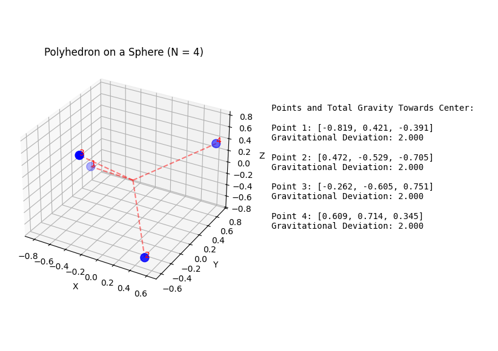
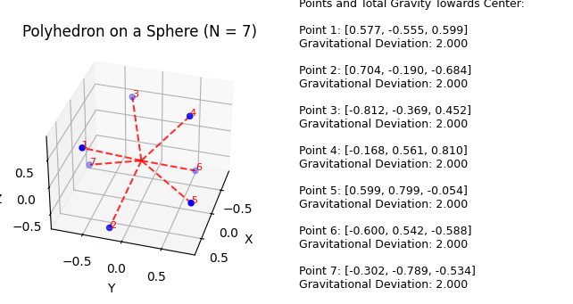
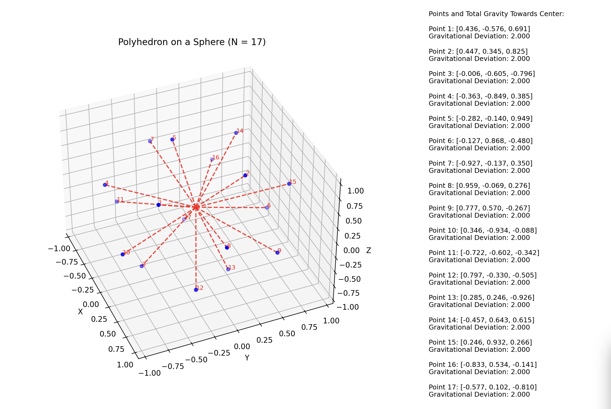
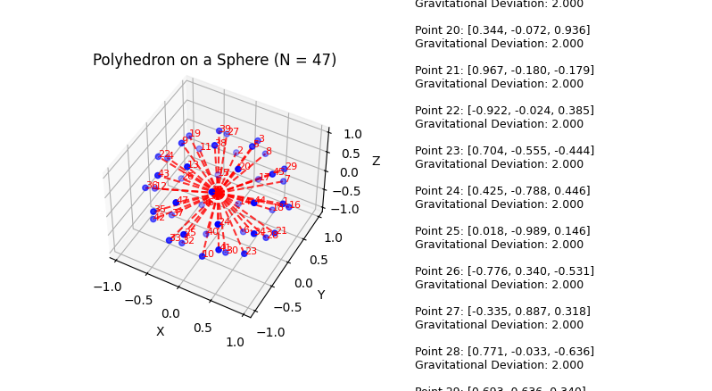
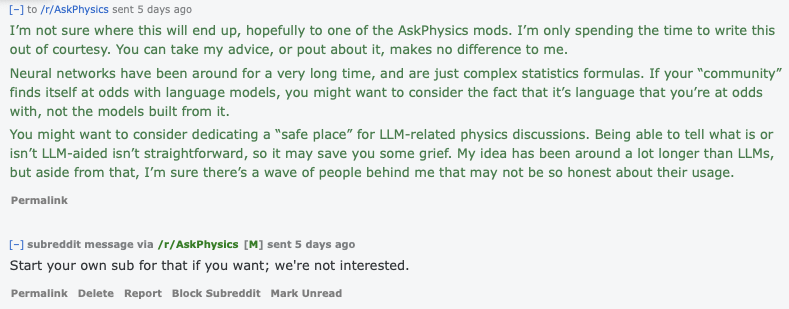

# Universal Theory of Kinetic Harmonics

## Abstract

Building upon previous work and scientific studies spanning from De Broglie, to Einstein, to modern day theories and experimental data, this article presents contributions within the framework of existing unified light-field theories. First, it hypothesizes that harmonic resonation is the fundamental cause of emergent properties and forces, supported by sonic wave experiments and observations of gravity and photon-mass interactions. Second, it attempts to present a novel and derivable geometric formula which can serve as a foundational mathematical framework to predict future conditions of these potential photon co-orbital patterns. When subsequently applied to existing known priciples, applicable phenomena range in scale from the subquantum to the cosmic. Finally, it provides references to observed and recorded data to provide evidence that photons in subquantum orbital patterns are consistent with the known observable properties of quantum particles and behaviors.

## Introduction

The hypothesis that orbital light patterns is a universal property underpinning the universe is not new1,2,3,4,16. General Relativity's energy-mass equivalence has been observed well enough at this point to call it a law of nature5,6. Relationships between the hypothetical angular speed of light and Planck's Constant have been well established7,8, hinting at a possible connection that could unite GR with Quantum Mechanics. There are many indications that gravity is an emergent property10,11. The spacial geometry of the effects of sonic resonance align with the curvature of spacetime just due to the inverse-square law, and recent experimental observations have indicated a direct, integral relationship between resonance and gravitational forces9,12,13,14,15. We know that light can used to directly sythensize massive particles33,34. Additionally, with the recent discovery of orbital light vortex experimentations it has been shown that there are clear, yet unexplained photonic properties20,21,25. This experimental data has opened up new avenues of proofs and speculations, such as light having angular momentum24,23, exhibiting harmonic properties22,26,27,30,31,32, effecting electric conductivity28, and even resulting in particle synthesisis35. Without assuming that light is what makes up larger particles, one must use have a strong imagination.

To say that the implications and scope of this theory are vast may be an understatement. Applying the theory and proposed geometry functions, in conjunction with Newtonian mechanics, the motion of linear and dynamic systems, waveform analysis, harmonic principles, and other well-established domains - multiply into a number of combined potential applications far too numerous for a single publication. The goal is to present the concepts topologically, yet rigorously, while presenting the derived mathematical and physically observed evidential support. The paper also, although unconventual in a scientific context, finishes with some philosophical and natural parallels. If correct, it has the potential for unique testable predictions to arise, new advancements in technology, and give new explanations to many long-standing questions our current frameworks leave unanswered.

The universal theory proposed in this paper begins with the assumption that all foundational properties of the universe arise from specific patterns formed from the transformation of the directional momentum of light into angular velocity, e.g. kinetic energy, into levels consistent with mass-energy equivalence. Sythesis of massive particles from light is a well observed phenomena, yet one that is interpreted differently by the mainstream. UTKH posits that emergent properties are founded on systems of different orbital light patterns. These systems (which I call kutonic systems, from their inherent kinetic nature) are described as stable patterns of orbital photons that exhibit and respond to resonant and harmonic frequencies from surrounding systems. The theory of these configurations is no more speculative than photon spheres, with the exception that it extends the theoretical configuration beyond black holes, applies it at all scales of physical nature from the subquantum to cosmic, and an elegent and consistent explanation for many of the mysteries of our universe.

While the theory may not necessarily assert that photons are a particle, it is useful for conceptual, mathematical, and geometric reasons to quantize these most basic states of the described systems (or a kuton) as a pair of photons in mutual co-orbit. It assumes that light's gravitational effects equal the energy of its momentum, but even then such a hypothetical system is subquantum in scale. However, since this theory makes the assumption that resonant harmonics are what give rise to gravitational and other such forces, it is necessary to assume that photons exhibit a higher-dimensional oscillatory property, so that such a condition can exist. This is a concept common, albeit differently interpreted by quantum mechanics. It is also echoed by the hyperdimensional simplicial set geometry used to derive the equations proposed. To state in a different way, photons must exhibit a force of attraction to each other in order to be in a hypothetical state of co-orbit. If we assume that the properties of resonance are the genesis of such forces based on GR-scale experiments, light must also have this property. That is in and of itself also not a novel idea, but by extending it to the relation between light, matter, and the underpinnings of quantum mechanics, it explains why we can observe partical-wave duality in quantum-level electron-positron pair experiments and entanglement. While the hypothetical scale of kutonic systems are sub-quantum, the hypothetical energy levels are not, and in fact are confirmed by general relativity. Since UTKH views mass, gravity, and other forces as emergent phenomena, the assumed scale of this condition is not as important as much as its geometrical configurations of momentum and potential effects of those forces on nearby systems, as well as the amplification of the forces of these systems in ensemble, resulting in cosmic-level forces that all fundamentally originate from subquantum events, and all following the consistent and intuitive laws of our observable universe.

### Foundational Theories and Observations

Existing emergent theories suggest gravity to be an emergent property36. Experimental data has been published that confirms the relationship between mechanical motion and gravitional forces. The geometric mechanics of resonant fields follow the Gravitational Constant due to the inverse-square nature of it. Resonant patterns can be observed in nature scaling from quantum principles, electron orbital patterns and thus chemical reactions, to fluid dynamics, planetary systems, and even biological behaviors - all lending to the idea that this theory may very well be a universal law of nature.

Optical vortex systems, which have been studied at various scales, indicate that our understanding of photon mechanics leaves profound opportunities for further exploration. While researchers currently explain observational data to be particles in a "twisted state", the results could also be interpreted as harmonically driven via Runge-Kutta methods or unbound orbital dynamics, since the experiment setup's fundamentally conical nature may not accurately be synthesizing the bound state described by kutonics. If the theory presented is correct, it could be applied to allow researchers to produce more consistent results in future experiments. For example, if we can determine the resonant frequencies of an electron $w_e$ and a proton $w_p$, we could align the experimental setup in a harmonic ratio where as:

$$\sum_{n=0}^\infty W_\tau \cdot \frac{1}{2^n} = W_n = w_e \cdot w_p$$

hypothetically optimizing the conditions for particle synthesis, tuning the experimental input in order to **synthesize a hydrogen atom** as well as more complex particle configurations, or targeting specific atomic structures to trigger certain events previously untested.

Applying ***simplicial complexes***, specifically the spherical geometry of polyhedrons, serves as an intuitive stepping stone by aligning the theoretical mechanics of potential photonic orbital patterns (which I call a kuton or kutonic system) and then aligning the input patterns of the input orbital vortices or photon frequency to the observed harmonics of these particles. Determining the specific orbital dynamics of particles, elements, and molecules would open vast doors in the realms of technology and scientific advancement.

Currently, attempts to mathematically compute such a configuration range from hinge theories to theses that do nothing more than explore the profound mathematical problem. Here, I demonstrate an effective and verifyable approach to that problem that has not yet been explored.

### Calculating Stable $N$-Vertex Polyhedron Configurations

Utilizing computer simulations, stable polyhedral vertex configurations were accomplished. This is not a new approach in and of itself, but these simulations followed the following algorithm:

 - $N$ points were introduced into a simulated 3-dimensional space.
 - Each point was applied in iterations with a concert of simulated forces:

   - All points were attracted to the center of the system.
   - All points repelled each other.
   - All points were constrained by a set proximity to the center of the system, as to result in a set of verices with a shared, consistent radius, and an even distribution along the surface of the polyhedral sphere.

After initialization and subsequent iterations of the algorithm, the system stabilized into configurations where each point settled on a spherical plane in a manner that was equidistent from its neighbors. Subsequently, the following pattern was observed:

 - For $N = 2$ the vertices are diametrically opposite, so $\cos\theta=-1$ and $\theta=\pi$ radians (thus forming a line passing throught he center of the sphere).
 - For $N = 3$ the vertices form an equilateral triangle on the bisectional equator, with $\cos\theta=-\frac{1}{2}$ and $\theta=\frac{2\pi}{3}$ radians, where the geometric center of the trinagle was the center of the sphere.
 - For $N = 4$ the vertices form a tetrahedron, with $\cos\theta=-\frac{1}{3}$ and $\cos\theta=\frac{\pi}{2}$

Generalizing this pattern, intuiviely the optimal angle of separation between adjacent points on a spherical polyhedron for any given $N \ge 3$ is:
    
$$\cos\theta=-\frac{1}{N-1}\cdot$$

Intiutively, this relationship arises because for $N$ points distributed uniformly on the sphere:

 - The angular separation decreases as $N$ increases.
 - The denominator $N-1$ ensures that the total angular coverage of the sphere is preserved while accounting for the increasing number of adjacent points.

Taking the inverse cosine yields the angular separation:

  $$\theta=\arccos\left(-\frac{1}{N-1}\right)\cdot$$

Hyper-dimensional computer simulations seem to confirm this equation.

### Alternate Symmetrical from Euler Derivative

Using Euler angles, the placement of points is parameterized by:

$$
\begin{align*} \alpha_i &= \frac{2\pi i}{N}, \quad i = 0, 1, \dots, N-1, \\ \beta &= \arccos\left(1 - \frac{2}{N}\right). \end{align*}
$$

**Relating $\theta$ and $\beta$**

The polar angle $\beta$ ensures uniform distribution in latitude based on the solid angle per point:

$$
\omega = \int_0^\beta 2\pi \sin\theta \, d\theta = \frac{4\pi}{N},
$$

yielding:

$$
\beta = \arccos\left(1 - \frac{2}{N}\right).
$$

The pairwise cosine relationship for two points on a sphere, parameterized by $(\alpha, \beta)$, is:

$$
\cos \theta_{ij} = \cos\beta_1 \cos\beta_2 + \sin\beta_1 \sin\beta_2 \cos(\alpha_1 - \alpha_2).
$$

For uniform distributions:
1. The average $\cos\theta_{ij}$ reduces to $-\frac{1}{N-1}$, consistent with the original derivation.
2. The Euler-derived coordinates, using $\beta = \arccos(1 - 2/N)$, enforce this symmetry by ensuring equivalent angular separations in both latitude ($\beta$) and longitude ($\alpha$).

## **Higher-Dimensional Projection and Gravitational Analysis**

Knowing the optimum angle between each point on the polyhedral sphere and the center of the sphere is not enough in order to graph the Euclidean coordinates of each point. More derivation was necessary to explore. To do so, I imagined a circle that had all the points along it's edges distributed in a normalized pattern, and then imagined that circle travelling perpendicular into a plane. This results in a 3-dimensional "shadow", and as the points came in contact with the plane, they could be graphed onto a 3-dimensional sphere.

Unfortunately, this was not adequate enough for even, normal distribution. To accomplish this, I introduced a hypothetical 4th dimension for each point. Intuitively, from simplicial set geometry, we know that:

 - A point has a simplicial complex of zero.
 - A line has a simplicial complex of 1.
 - A plane has a simplicial complex of 2

And so on. By utilizing the previously derived forumula for optimal angular difference between vertices, graphing the points onto 4-dimensional space, projecting the points into 3-dimensional space, and then adding the following energy equation:

$$
E = \sum_{m \neq n} \left( \cos\theta_{mn} - \cos\theta_{\text{ideal}} \right)^2
$$

where:
  - $\cos\theta_{mn} = \mathbf{P}_m \cdot \mathbf{P}_n$, the cosine of the angular separation between points $P_m$ and $P_n$
  - $\cos\theta_{\text{ideal}} = -\frac{1}{N-1}$, the ideal cosine value for angular separation.

This function minimizes deviations from the ideal angular separation $\theta_{\text{ideal}}$, ensuring the most uniform distribution of $N$ points on the unit sphere. These simulations were performed with multiple values of $N$, including $2, 3, 4, 5$ as well as higher prime numbers such as $13, 17, 23, 83$ et cetera. All resulting graphs fit the desired criteria.

### **Deeper Dive: Angular Separation on the Sphere**

The foundation of this method lies in the angular separation between $N$ points distributed symmetrically on a sphere. The angular separation, $\theta$, as previously derived:

$$
\cos\theta = -\frac{1}{N-1}
$$

where:
- $N$ is the number of points,
- $\theta$ is the angular separation between adjacent points, assuming an ideal symmetric distribution.

This formula ensures that the points are distributed as uniformly as possible while maintaining geometric constraints. The derivation follows directly from the condition that the dot product of unit vectors between any two points satisfies

$$
\cos\theta = \mathbf{P}_1 \cdot \mathbf{P}_2
$$

By rearranging points to minimize deviations from $-\frac{1}{N-1}$, the points achieve an approximate optimal configuration.

---

### **Embedding in Higher Dimensions**

For $N\gt3$, perfect symmetry requires embedding the points into a Hilbert space, so that the simplicial complex of the higher-dimensional qubit is that of a Bloch SIC-POVM regular tetrahedron.

$$
\mathbf{v}_k=\begin{cases}1&\text{if}k=\ell,\\
-\frac{1}{N-1}&\text{if}k\neq\ell\end{cases}
$$

The vertices are normalized to ensure they lie on the unit $(N-1)$ - dimensional sphere:

$$
\mathbf{v}_k=\frac{\mathbf{v}_k}{\|\mathbf{v}_k\|}
$$

After constructing the higher-dimensional simplex, the points are projected onto the 3D sphere. The projection is defined as taking the first three components of each vector:

$$
\mathbf{P}_k = \text{Proj}_{3D}(\mathbf{v}_k)
$$

Finally, the projected points are re-normalized to the unit sphere:

$$
\mathbf{P}_k = \frac{\mathbf{P}_k}{\|\mathbf{P}_k\|}
$$

This process maintains the symmetry of the distribution while reducing the dimensionality.

  *Figure 1*  
  

  *Figure 2*  
  

  *Figure 3*  
  

  *Figure 4*  
  

---

### **Gravitational Force Analysis**

To verify the stability and symmetry of the arrangement, the total gravitational force acting on each point is calculated. The gravitational force between two points $P_m$ and $P_n$ is given by:

$$
F_{mn}=G\cdot\frac{m_m m_n}{r_{m_n}^2}\cdot\hat{{r}}_{m_n}
$$

where:
- $G$ is the gravitational constant (normalized to $1$),
- $m_m$ and $m_n$ are the masses of points (assumed equal, $m = 1$),
- $r_{m_n} = \|\mathbf{P}_n - \mathbf{P}_m\|$ is the Euclidean distance between points $P_m$ and $P_n$,
- $\hat{\mathbf{r}}_{m_n} = \frac{\mathbf{P}_n - \mathbf{P}_m}{\|\mathbf{P}_n - \mathbf{P}_m\|}$ is the unit vector pointing from $P_m$ to $P_n$.

The net gravitational force acting on point $P_m$ is then:

$$
{F}_m=\sum_{n \neq m}{F}_{m_n}
$$

To ensure symmetry, the direction of the total gravitational force $\mathbf{F}_m$ is compared with the vector pointing toward the center of the sphere:

$$
\hat{\mathbf{F}}_m = \frac{\mathbf{F}_m}{\|\mathbf{F}_m\|}
$$

Ideally, $\hat{\mathbf{F}}_m$ should align with the vector pointing to the origin, confirming that the system is gravitationally stable and symmetric. All tests with the polyhedral forumula pass this test, even in complex systems.

---

### **Energy Optimization for Point Distribution**

The final configuration of points minimizes the potential energy function, which penalizes deviations from the ideal angular separation:

$$
E = \sum_{m \neq n} \left( \cos\theta_{mn} - \cos\theta_{\text{ideal}} \right)^2
$$

where:
- $\cos\theta_{m_n} = \mathbf{P}_m \cdot \mathbf{P}_n$ is the cosine of the angular separation between points $P_m$ and $P_n$,
- $\cos\theta_{\text{ideal}} = -\frac{1}{N-1}$.

This optimization ensures that the points achieve maximum angular separation while remaining on the unit sphere.

### Physical Implications of Stable Spherical Polyhedrons

It was interesting to note that while the formula produces evenly-distributed verticies along the spherical plane of polyhedrons, they did not always result in Platonic polyhedrons, even in cases where $N = 8$ where one might expect a perfect cube. However, the gravitational totals still equate to zero, meaning these structures don't have to be "perfect" to form. I see this as a promising sign that the conditions for these systems do not need to be so exact in order to form.

### The Mythic Nature of the Tammes and Thomson Prolbems

Even in higher dimensions, simulations seem to indicate that these problems represent a limit equation rather than a concrete formula. Multiple configurations of objects can adequately fit the bill for either problem. While tests are ongoing, they do not need to be exact to accurately simulate configurations for either complex.

#### A General Formula for Uniform Angular Separation 

  - **Derivation:**

    The average angular separation between vertices in uniform polyhedrons should satisfy the geometric constraints of the sphere. For two points $p_1$ and $p_2$ with unit vectors, the cosine of the angle between them is given by the dot product, where $\theta$ is the angular distance between adjacent points:

    $$\cos \theta = p_1 \cdot p_2 \ldotp$$

    For uniform distributions, the angular separation, $\theta$, must be consistent across all adjacent points. To achieve this, we rely on the property of spherical symmetry, where the average cosine between any two adjacent points depends on the number of points $N$.

    Intuitively:
      - For $N = 2$, the points are diametrically opposite, so $\cos \theta = -1$ and $\theta = \pi$ radians.
      - For $N = 3$, the points form an equilateral triangle in the plane, with $\cos \theta = -\frac{1}{2}$ and $\theta = 120\degree$ (or $\frac{2\pi}{3}$ radians).
      - For $N = 4$, the points form a tetrahedron, with $\cos \theta = -\frac{1}{3}$.
    
    Generalizing this pattern, the cosine of the angular separation between adjacent points for any $N \gt 2$ is:

    $$\cos\theta = -\frac{1}{N - 1}\cdot $$

    Taking the inverse cosine yields the angular separation:

    $$\theta = \arccos\bigg\lparen\frac{-1}{N - 1}\bigg\rparen$$

    This formula may be applicable to higher dimensions but that has not yet been tested beyond $\approx$ 20 verticies.
     
### Harmonic Hints in the Bohr Radius ($a_0$)

  - We know the Bohr radius as:

$$a_0 = \frac{4\pi \epsilon_0 \hbar^2}{m_e e^2}$$

  - Using the calculated $r_e$:

$$r_e \approx \frac{1}{3}a_0$$

  - The kutonic orbital radius is smaller than the Bohr radius, which reflects the intrinsic resonant scale of the electron itself rather than the electron's spatial configuration in an atom.
       - The difference in scale can be attributed to the Coulomb interaction between the electron and nucleus in the atom, which influences the Bohr radius but is not relevant to the intrinsic kutonic system.

### Deriving Harmonic Relationships Between Orbital Radius Ratios and Mass Ratios 

Since protons have a positive charge and exhibit electromagnetic attraction, here we propose to relate the ratio between the hypothetical orbital radii differences and the differences in mass of protons, neutrons, and electrons.

1. **Define the Kutonic Electron's Orbital Radius ($r_e$)**
   
   $$r_e = \frac{2\pi h}{m_e c} \approx 1.513 \times 10^{-11} \ \text{meters}$$

   (where $m_e \approx 9.109^{-31}$ kg) 

2. **Calculate the Orbital Radius for the Mass Difference Kuton ($r_{\Delta m}$)**
   
   $$r_{\Delta m} = \frac{2\pi h c}{\Delta m}$$
   
   - **Mass Difference ($\Delta m$) Between Neutron and Proton:**
     
   $$\Delta m = m_n - m_p \approx 2.305 \times 10^{-30} \ \text{kg}$$

     (where $m_n \approx 1.674927^{-27}$ kg and $m_p \approx 1.672621^{-27}$ kg)
   
   - **Calculation:**
     
   $$r_{\Delta m} \approx \frac{2\pi \times 6.626 \times 10^{-34} \times 2.998 \times 10^8}{2.305 \times 10^{-30}} \approx 6.018 \times 10^{-12} \ \text{kg}$$

3. **Determine the Ratio of Orbital Radii**
   
$$\frac{r_e}{r_{\Delta m}} = \frac{1.513 \times 10^{-11}}{6.018 \times 10^{-12}} \approx 2.515$$
   
   - **Interpretation:** The orbital radius of the kutonic electron (meters/kg) is approximately **2.515** times larger than that of the mass difference kuton.

4. **Compare with the Mass Ratio**
   
$$\frac{m_e}{\Delta m} = \frac{9.109 \times 10^{-31}}{2.305 \times 10^{-30}} \approx 0.395$$
   
   - **Observation:** The ratio of orbital radii ($\approx 2.515$) is **inversely proportional** to the mass ratio ($\approx 0.395$), **indicating a harmonic relationship.**
   
   - The proportionality between the orbital radii and the inverse of the mass ratios suggests that:
     
     $$r \propto \frac{1}{m}$$

5. **Now Hold On a Second.**

*Why are we comparing a ratio between units of $\frac{\text{meters}}{kg}$ to $\frac{kg}{kg}$?*

What may seem like nonsense superficially, remember the observed **Uniform Angular Separation** formula, $\theta = \arccos\big\lparen\frac{-1}{N - 1}\big\rparen$ that defines the geometric angles for complex orbital systems. The inverse proportion of the observed mass between these systems and the distance (which at an angle is across the surface of it's spherical shape) is consistent with the foundational geometry for establishing stable co-orbital patterns. This is **exactly what we should expect** if we consider that all states are derivatives of sub-quantum orbital motion.
     
   - **Implication:** This alignment indicates that in the UTKH framework, the harmonic and orbital configurations of kutonic systems inherently relate to the mass properties of fundamental particles. It is already well accepted that electron orbitals follow polyhedral spacial patterns, and echoes known molecular structures. With further research into complex photonic orbital geometries, we could define sub-quantum properties and predict their events with similar or better precision.

   - **Electrons** are likely not separate "particles", but rather outer-layers of free-moving orbital entities in the form of angular light momentum.

   - **It may be quite possible** to derive the orbital configurations precisely by comparing measurements such as these and comparing them to simulated orbital equations linearlly.

## Proposed Theoretical Mathematical Frameworks 

While this theory is still under development, I present some hypotheses as to how to calculate the specific nature of kutons and kutonic systems, which could help align this theory with observable events. Please note that these are merely hypothetical and do not yet attempt to provide quantized predictions, however it does hope to do so in the future.

### Kinetic Harmonic Resonance 

In theory, when two or more systems interact, their frequencies may not match exactly. However, if they share a common harmonic relationship (i.e., their frequencies are related by simple ratios), energy transfer between them becomes more efficient. This is reflected in the *kinetic harmonic resonance* (KHR) ratio, which can be used to predict the degree of resonance and energy exchange.

Let's define the kinetic harmonic resonance (KHR) as:

$$\Psi = \frac{\Omega}{\omega} = \frac{2\pi f}{\omega_0}$$

where $\Psi$ is the KHR ratio, $\Omega$ is the angular frequency of the system, $f$ is the frequency, and $\omega_0$ is the fundamental frequency.

The KHR ratio, $\Psi$, is introduced as a measure of the alignment between the angular frequency of a system ($\Omega$) and its fundamental frequency ($\omega_0$). This ratio can be seen as an extension of the traditional harmonic series, where $\Psi = 1$ represents perfect resonance.

### Harmonic Entanglement 

In theory, when $\Upsilon = 1$, the systems are perfectly entangled, and energy transfer becomes highly efficient. Conversely, as $\Upsilon$ approaches zero, the systems become less correlated, and energy transfer decreases.

The harmonic entanglement (HE) can be described by:

$$
\Upsilon = \frac{\Psi}{\sqrt{1 - \Psi^2}}
$$

where $\Upsilon$ represents the degree of harmonic entanglement between two or more systems.

The HE equation introduces the concept of entanglement between systems, where $\Upsilon$ represents the degree of correlation between their harmonic structures. In essence, this equation attempts to quantify the extent to which two or more systems become "tuned" to each other's frequencies.

### Energy Flow Alignment 

In theory, when $\Theta = 0$, the energy flow is perfectly aligned with the harmonic structure, allowing for maximum energy transfer efficiency. As $\Theta$ increases, the alignment decreases, and energy transfer becomes less efficient.

The energy flow alignment (EFA) can be calculated using:

$$
\Theta = \arctan\left(\frac{\Upsilon}{\Psi}\right)
$$

where $\Theta$ is the angle of energy flow alignment.

The EFA equation describes the alignment of energy flow between interacting systems. The angle $\Theta$ represents the degree to which the energy flow is aligned with the harmonic structure of the systems involved.

---

## Experimental Predictions 

UTKH offers testable predictions that span diverse domains of physics. These experiments aim to validate the theory's core principles, including resonance-driven attraction, photon-photon sphere stabilization, and the role of hyperdimensional oscillations.

### Gravitational Effects of Resonating Tuning Forks 

**If UTKH is in fact universal, a pair of vibrating objects should exhibit a small force of attraction to each other:**

###### *It turns out that [this has laboratory tested recently](https://arxiv.org/abs/2201.03420), positively affirming UTKH's expectations*.

- **Predicted Observation:**
  - Two tuning forks, vibrating at the same harmonic frequency and placed in close proximity, will experience a measurable attractive force due to resonance. The magnitude of this force should increase as their frequency alignment becomes more precise and as the amplitude of their vibrations grows. This force, while extremely small, could cause the forks to shift slightly toward one another over time, detectable as a subtle change in their relative positions or oscillation dynamics.

- **Experimental Setup:**
  - Use two identical tuning forks mounted on a vibration-isolated platform within a vacuum chamber to eliminate air resistance and external noise.
  - Attach each tuning fork to a highly sensitive force sensor or interferometric position detector to monitor any movement or change in distance.
  - Initiate resonance in one tuning fork using an external driver (e.g., a piezoelectric actuator) and observe whether the second fork begins to move or synchronize its vibrations.
  - Gradually vary the separation distance and monitor whether the predicted force changes as a function of distance or frequency alignment.
  - Employ laser interferometry for sub-micron precision in detecting any shifts in position, and compare the results to control experiments where only one tuning fork is vibrating.

### Observing Resonance in Prism-Based Light Experiments 

Prisms provide a unique opportunity to study the resonance effects of light:

- **Predicted Observation:**
  - Light passing through a prism should exhibit subtle frequency shifts or polarization patterns as it interacts with the resonant structure of the material. Such anomolies could have been subtle enough to have been overlooked in past experiments.
  - These shifts may include:
    - A deviation from classical dispersion models.
    - Evidence of hyperdimensional oscillations in the form of unaccounted-for spectral lines, gravitational waves, or other kutonic signatures.

- **Experimental Setup:**
  - Shine monochromatic light through a prism made of materials with varying molecular resonances.
  - Use highly sensitive spectrometers to detect anomalous dispersion or additional spectral features.

### Polarization and Higher-Dimensional Effects 

Polarization studies can reveal the presence of higher-dimensional oscillations:

- **Predicted Observation:**
  - Light passing through polarizers in rapid succession should exhibit unexpected phase shifts or oscillatory patterns that deviate from classical optics.
  - These effects would indicate interactions with unseen dimensions.

- **Experimental Setup:**
  - Pass polarized light through multiple polarizers at varying angles.
  - Measure phase shifts and intensity changes using interferometers to detect higher-dimensional effects.

### Light and Conductors 
- Use polarized light to illuminate a conductor and measure:
  - Whether the light induces or disrupts current flow.
  - Changes in the conductor's resistance or magnetic field.

### Extreme Light-Matter Interactions 

High-intensity laser experiments, or current data from existing experiments can probe the resonance-driven behaviors of light and matter:

###### *Similar results have been observed frequently in nuclear/particle testing. It may be fruitful to revisit the test result in order to better define harmonic signatures of specific particles.*

- **Predicted Observation:**
  - When two high-power lasers intersect in a vacuum, the resulting interaction should:
    - Create transient harmonic structures resembling localized mass, dark matter, or quantum-phase sub-particles.
    - Potentially emit low-energy gravitational waves or other detectable resonant artifacts.

- **Experimental Setup:**
  - Use two ultra-high-intensity lasers (e.g., petawatt lasers) focused on a single point in a controlled vacuum chamber.
  - Deploy gravitational wave detectors or sensitive instruments to measure anomalies in the surrounding energy field.

### High-Intensity Optical Vortex-Matter Interactions 

Ongoing experiments with high-intensity optical vortices could probe the possibility/validity of UTKH:

- **Predicted Observations:**
  - Photon-photon vortices resulting in electron-positron pairs should provide evidence of the natural frequencies of these particles.
  - Vortex photon interaction with nuclei and other particles should help provide the natural frequency of different particles and sub-particles.
  - By tuning the light frequency and vortex patterns to match the harmonics of specific particles, we should be able to create specific particles more consistently, and even perhaps complex elements such as hydrogen or helium atoms
  - By tuning vortex and light frequencies to those that are disruptive to the harmonic signature of massive particles, atoms, or molecules, we should be able to specifically target desired outcomes at quantum, nuclear, or chemical scales.

### Resonance in Atomic Systems 

- Shine specific frequencies of light (e.g., lasers) onto molecules or atomic gases and observe:
  - Changes in chemical bonds (e.g., breaking or strengthening).
  - Absorption/emission spectra revealing specific harmonic interactions.

### Fusion and Fission Harmonic Analysis 

Nuclear reactions provide a window into the role of harmonic resonance in energy redistribution:
- **Fusion Predictions:**
  - During fusion, the emitted radiation should contain patterns corresponding to the harmonics of the initial and final co-orbital systems.
  - Example: Analyze the frequencies of emitted gamma rays for harmonic structures not predicted by standard nuclear physics.
- **Fission Predictions:**
  - Fission reactions should produce asymmetric energy distributions reflecting the disruption of harmonic resonances.
- **Experimental Setup:**
  - Use advanced radiation detectors during controlled nuclear reactions to identify anomalous harmonic energy patterns.

---

## Applications to Physics 

Research is ongoing as to applying this theory to existing experimental data. Expectations are that harmonic signatures will be derived that could greatly tune or amplify quantum conditions.

### Relativity and Cosmology 

#### Revisiting the Speed of Light 
- UTKH reinterprets the speed of light as the maximum resonance velocity of energy flows. This explains:
  - Light's invariant speed in a vacuum.
  - Why the speed of light serves as a universal limit for energy and information transfer.
  - Photons with wider orbital patterns, while still travelling at the speed of light, will emit, enact, and respond to other forces in both constructive or destructive ways.

### Particles and Anti-Particles
- UTKH does not see these as "different" other than the fact that their oscillations are the inverse of each other. This explains both entanglement, and why when combined they simply cease to exist - they are inherently mutually destructive interference patterns of each others' orbital frequencies.

#### A Unified Explanation for Dark Matter and Dark Energy 
- **Dark Matter:** Resonant energy flows that do not emit detectable radiation may account for the gravitational effects attributed to dark matter.
- **Dark Energy:** The universe's accelerating expansion could reflect the outward projection of large-scale harmonic energy flows.

#### A New Understanding of Black Holes 
- UTKH does not see black holes as singularities, but rather complex co-orbital systems whose outer layer consists of lower-frequency harmonics.
  - An outer layer of co-orbitals of lower-frequency harmonics would absorb energy emitted from the core, resulting in the lack of emitted light
  - The complexity of the interactions between the co-orbiting harmonics of the core along with the dynamic motion states in the outer layer could explain x-ray emissions.

#### Implications for Redshift 
- UTKH offers an alternative explanation for redshift:
  - As light travels across vast distances, it interacts with the resonance fields of cosmic structures, causing a gradual energy loss and wavelength elongation.
  - This complements the Doppler effect and gravitational redshift while introducing a resonance-driven mechanism.

### Atomic Elements and Resonance 

#### How Resonance Creates Atomic Elements 
- **Mass and Particles as Resonances:**
  - Mass and particles emerge from stable kutonic energy systems.
  - Atomic elements represent organized, higher-order patterns of these resonances.

#### Light Resonance and Atomic Structure 
- Each atomic element corresponds to a unique resonance state of co-orbital energy flows.
- The number of protons, neutrons, and electrons in an atom reflects the harmonic stability of these energy patterns.

#### Key Features of Atomic Resonance 
1. **Protons and Neutrons:**
   - Protons and neutrons are stable co-orbital systems of light flows in tightly bound resonances.
   - The strong nuclear force arises from the resonance harmonics that bind these systems together.
   - The true difference between a proton and a neutron is merely the differences in periapsis and apoasis of the "electron's" addition to the proton to become a neutron. This would lend to believe that a neutron, if perturbed with sub-quantum precision, could realign into a hydrogen atom.
   - Naturally, the number of protons defines the element because it determines the periapsis and apoasis of the free-orbital kutonic electrons, effecting the resonance frequency of the entire system, and defining chemical behaviors.
   
2. **Electrons:**
   - Electrons are smaller, less tightly bound co-orbital energy systems that interact with the proton-neutron core (the nucleus).
   - The "orbitals" of electrons around a nucleus represent regions of stable resonance in the surrounding energy field.
   - Electron shells and their discrete energy levels correspond to quantized harmonic frequencies of these co-orbital patterns.

### Molecules and Chemical Bonds 

#### Chemical Bonds as Resonance Alignments 
1. **Covalent Bonds:**
   - Covalent bonds form when two atomic systems align their outer electron resonance patterns, creating a shared, stable energy flow.
   - The strength of a covalent bond reflects the stability of this shared resonance.
   
2. **Ionic Bonds:**
   - Ionic bonds occur when one atom's resonance (electron pattern) dominates, effectively "capturing" the outer electron of another atom.
   - This results in two charged systems that remain bound through the attraction of opposing resonances.
   
3. **Van der Waals Forces:**
   - Weak, temporary resonances between fluctuating light flows in adjacent systems explain weaker intermolecular forces.

### Electricity 

Electricity is traditionally defined as the flow of electrons through a conductor. UTKH reframes this as the organized movement of co-orbital energy systems (electrons) through a system of harmonically resonant co-orbital systems.

#### Key Features of Electricity
1. **Electric Current as Directed Energy Flow:**
   - In UTKH, electrons flow as guided energy packets, maintaining their co-orbital structure while transferring their resonance through the atomic lattice of a conductor.
   - The flow is driven by an external energy gradient (e.g., a voltage).

2. **Voltage (Potential Difference):**
   - Voltage represents a difference in energy density or resonance intensity between two points, analogous to water flowing downhill.
   
3. **Resistance:**
   - Resistance arises when the co-orbital resonance patterns of flowing electrons interact with the atomic resonances of the conductor, dissipating energy as heat.

4. **Conductors vs. Insulators:**
   - Conductors have atomic resonance patterns that align well with flowing electrons, allowing easy propagation of energy.
   - Insulators have resonance patterns that disrupt or block electron flow, preventing current.

5. **Magnetism and Electromagnetic Fields:**
   - Magnetism arises when the resonance patterns of moving electrons align, creating a larger, unified resonance field.
   - Electromagnetic waves (light) are the natural result of oscillating co-orbital energy systems propagating through space.

### Nuclear Reactions: Fission and Fusion 

#### Energy Redistribution and Resonance Shifts 
- In UTKH, nuclear reactions involve the reorganization of co-orbital systems:
  - **Fission:** The splitting of a stable co-orbital system, such as a heavy nucleus, disrupts its harmonic state, releasing the stored resonance energy.
  - **Fusion:** The merging of smaller systems, such as hydrogen nuclei, into a larger, more stable co-orbital resonance also releases energy due to the optimization of harmonic flows.

#### Implications for Nuclear Stability 
- The stability of an atomic nucleus reflects its internal harmonic balance:
  - Heavy nuclei are resonant but prone to destabilization, leading to fission.
  - Light nuclei, when fused, achieve greater resonance stability, releasing vast amounts of energy.

#### The Role of Resonance in Measurement and Collapse 
- Measurement disrupts a system's resonance, forcing it to stabilize into a specific harmonic state. This explains the collapse of the wavefunction in quantum mechanics as a natural outcome of resonance stabilization.

#### Impact of High-Energy Directional Light with Stable Orbital Systems (Atoms) 

- When high-energy directional photons strike or approach the core of an atom, that energy is then instantly transferred into angular momentum in equal-but-opposite directions, resulting in electron-positron pair observations.

---

## Applications to Technology 

UTKH has far-reaching implications for technology, providing new insights into materials science, medicine, and quantum computing. By understanding the role of harmonic resonance in energy systems, UTKH offers innovative approaches to designing and optimizing technological systems.

### Resonance-Based Materials Science 

#### Designing Superconductors and Resonant Structures 
- **Superconductivity:** UTKH suggests that superconductors achieve their properties by aligning electron energy flows into stable harmonic resonances, minimizing resistance.
  - **Implication:** By tuning materials to enhance resonance alignment, we could design superconductors with higher critical temperatures and improved efficiency.
- **Resonant Structures:**
  - Resonance can be harnessed to design materials that optimize energy transfer or storage, such as:
    - Photonic crystals for precise light manipulation.
    - Metamaterials with tailored harmonic properties for wave redirection or amplification.

---

### Medical Implications 

#### Understanding Molecular Resonance in Biological Systems 
- **Biological Resonance:**
  - UTKH redefines molecular interactions as resonance-driven phenomena, suggesting that:
    - Proteins fold into specific shapes because their atomic components align into stable harmonic patterns.
    - Enzymatic activity is influenced by the resonance states of involved molecules.
- **Implication for Research:**
  - Understanding resonance at the molecular level could improve drug design by predicting how molecules interact harmonically.

#### Impacts on Protein Folding and Cellular Communication 
- **Protein Folding:**
  - Misfolded proteins (associated with diseases like Alzheimer's) could be understood as disruptions in harmonic alignment. Correcting these disruptions might restore proper function.
- **Cellular Communication:**
  - Cellular signaling (e.g., ion channel activity, neurotransmitter release) could be optimized by targeting their underlying resonance states, leading to breakthroughs in treating neurological disorders.
- **Low Energy Resonant or Interferent Wavelengths:**
  - With light energy tuned precisely, even in low levels, it could produce disruptive or constructive effects on specifically-targeted biological-chemical reactions.

---

### Quantum Computing 

#### Resonance as the Basis for Qubit Stability 
- **Qubits and Harmonics:**
  - Quantum computing relies on the stability of qubits, which are highly sensitive to environmental disturbances. UTKH suggests that:
    - Stable qubits emerge from properly aligned harmonic resonances.
    - Errors in qubits could be minimized by designing systems that maintain their resonance stability.
- **Implications for Scalability:**
  - By harnessing resonance principles, quantum computers could achieve greater scalability and efficiency, potentially overcoming current hardware limitations.

---

### Addressing Criticisms 

UTKH expects to face questions and challenges, particularly around three key areas:

1. **Why Resonance Has These Properties**
    - Resonance is well-documented in physics (e.g., musical instruments, atomic orbitals). UTKH generalizes this principle across all energy systems, positing that stability arises from energy minimization through resonance.

2. **Hyperdimensional Oscillations**
    - While direct observation of higher dimensions is unlikely, measurable effects (e.g., spectral anomalies, polarization patterns) can validate the theory.

3. **Limitations of UTKH**
    - Current experimental tools may lack the precision to detect subtle harmonic effects. Incremental testing and theoretical refinement may be necessary for broader acceptance.

---

## Observable Parallels in Nature 

While less of a theory and more of a poetic parallel, Nature favors configurations that minimize instability, a principle reflected in phenomena ranging from atomic orbitals to planetary systems. Resonance achieves this by:
- Aligning energy flows into harmonic patterns.
- Reducing destructive interference and energy dissipation.
UTKH extends this principle universally, proposing that all stable systems — from atoms to galaxies — arise from resonance-driven minimization of instability. Even low-energy, focused, and harmonically targeted energy could produce profoundly precise results on specific chemical interactions while leaving other biological functions seemlessly unaffected.

### Symmetry and Harmonic Structures 

Symmetry plays a critical role in resonance:
- Harmonic systems naturally align with the symmetries of their environment, leading to the formation of predictable patterns (e.g., atomic structures, crystalline lattices).
- This aligns with the mathematical foundations of physics, where solutions to wave equations inherently reflect symmetry and stability of the wave equation.

### Parallels with Well Known Physical Properties 

UTKH proposes that resonance-based attraction underpins phenomena traditionally attributed to mass and gravity. Several natural systems demonstrate behaviors that align with this principle, suggesting that kuton resonance plays a universal role in stabilizing dynamic systems.

#### Vortex Behavior in Fluid Dynamics 

In fluid dynamics, vortices exhibit behaviors that resemble the co-orbital attraction described in UTKH:
- **Mutual Attraction and Merging:**
  - Adjacent vortices, such as tornadoes or whirlpools, can spiral toward one another, eventually merging into a single, more stable vortex.
  - This behavior mirrors how co-orbital systems align into stable harmonic patterns.
- **Example:**
  - Atmospheric vortices, like those seen in hurricanes or water whirlpools, often interact dynamically, stabilizing through energy redistribution.

#### Orbital Resonances in Celestial Systems 

Celestial mechanics provides clear examples of resonance-driven attraction:

- **Orbital Resonances:**
  - The Kirkwood gaps in the asteroid belt result from harmonic interactions with Jupiter, demonstrating how resonance governs stability in large-scale systems.
  - Pluto and Neptune are locked in a 3:2 resonance, preventing close encounters and stabilizing their orbits despite overlapping paths in the Solar System.

- **Lagrange Points:**
  - Stable points in a two-body system, such as the Earth-Sun system, allow smaller objects to co-orbit in harmonic balance (e.g., the Trojan asteroids near Jupiter). These points exemplify how resonance-driven dynamics create equilibrium zones in gravitational fields.

- **Tidal Locking:**
  - The Moon is tidally locked to Earth, meaning one hemisphere always faces the planet. This resonance arises from energy dissipation and gravitational interactions that stabilize rotational and orbital dynamics over time.

- **Ring Systems:**
  - The gaps in Saturn's rings (e.g., the Cassini Division) are caused by resonances with its moons, where orbital interactions eject particles from unstable zones, leaving well-defined gaps.

- **Mean-Motion Resonances in Exoplanets:**
  - Exoplanetary systems often exhibit resonances where planets orbit their stars in harmonic ratios, such as 2:1 or 3:2. These resonances enhance orbital stability and are observed in systems like Kepler-223.

- **Implication:**
  - These phenomena suggest that energy flows between orbiting systems naturally stabilize into predictable, resonant patterns.

#### Electromagnetic Dipole Interactions 

Electromagnetic systems exhibit behaviors consistent with harmonic resonance:

- **Magnetic Field Coupling:**
  - Rotating charged particles generate magnetic fields that interact dynamically, forming stable systems under certain conditions.

- **Dipole-Dipole Interactions:**
  - Magnetic dipoles attract or repel depending on their alignment, resembling the dynamic alignment seen in co-orbital resonance.

#### Biological Swarming and Collective Behaviors 

Resonance-like behaviors also appear in biological systems:

- **Swarming and Alignment:**
  - Groups of animals, such as birds in flocks or fish in schools, exhibit collective behaviors where individual motions align dynamically to form stable group patterns.
  - Example: Starlings in murmurations create large, synchronized groups, adjusting to maintain stability and coherence.

- **Implication:**
  - These behaviors suggest that harmonic alignment is a universal organizing principle, transcending traditional definitions of mass and gravity.

These natural phenomena illustrate how systems in motion naturally stabilize through harmonic resonance:

1. **Universality of Resonance:** 
   - The observed behaviors in fluids, celestial mechanics, and electromagnetic systems reinforce UTKH's claim that resonance-based attraction is fundamental to the universe.

2. **Dynamic Stabilization:**
   - Systems in motion align and stabilize into predictable patterns, minimizing energy dissipation and maximizing stability.

### Parallels with Emergent Theories 

UTKH redefines gravity as a harmonic interaction between kinetic systems, giving a predictable and/or measurable framework for gravitons, and lends to new theories from the subatomic to deep space. It provides new theories to questions previously unanswered, it simultaneously coincides with existing known phenomena and emergent theories, some of which UTKH gives new hypotheses:

- **Quantum Gravity:** Mass and energy are sources of spacetime curvature, yet photons contribute to this curvature even though they are massless due to their energy and momentum.

- **Higgs Fields:** UTKH allows situations that give mass to properties, explained by harmonic resonation or direct angular energy transfer.

- **Entropic Gravity:** UTKH agrees that gravity is an emergent force, explaining that it arises from kutonic systems.

- **Photon Gas:** In a high-energy photon gas (e.g., early universe), the energy density contributes to gravity as if it were massive.

- **Quantum Electrodynamics:** Photons interact via virtual particles (e.g., electron-positron pairs), which can create transient effective mass.

- **Loop Quantum Gravity (LQG):** In LQG, spacetime is quantized into discrete loops of energy. Photons in a coesiting photon sphere might localize energy into a quantized "node" or form a stable configuration forming mass.

- **String Theory:** A kutonic system could create resonance conditions for certain vibrational states, or manifest mass as an emergent property of confined energy.

- **Holographic Principle:** UTKH's core principle is that photons approaching infinitesimal orbits exhibit mass-like behavior, much like a "hologram". The Holographic Principle may actually be indicating a microcosm of how mass arises in larger-scale structures.

- **Spacetime Resonance:** Spacetime itself can be viewed as a large-scale harmonic field, where curvature reflects energy flows aligned into resonant patterns.

- **Quantum Entanglement:** UTKH suggests that harmonic resonance could underpin entanglement. Photons in co-orbital patterns may maintain phase relationships analogous to entangled states, implying that resonance is a deeper, unifying principle behind quantum correlations.

- **Causal Sets:** In causal set theory, spacetime is a discrete structure made of fundamental events. UTKH proposes that kutonic systems form the "threads" connecting these events, harmonizing energy transfer across causal links and potentially defining spacetime at its most fundamental level.

- **Tensor Networks:** Tensor networks, used in quantum information and holography, represent entanglement structures. UTKH suggests that the harmonic interactions of kutons could map naturally onto tensor networks, where resonance defines the connectivity and geometry of the quantum system.

- **Superposition:** UTKH posits that particles exist in superposition because their resonances span multiple harmonic states until observed.

- **Zero-Point Energy:** Ever-present resonances maintaining a baseline "vibrational state" seemlessly link the Casimir Effect and quantum fluctuations to the kutonic framework. This perspective suggests that zero-point energy is not merely a quantum artifact but a manifestation of underlying harmonic dynamics inherent to the universe.

### Bridging Microscopic and Macroscopic Physics 

The principles of UTKH bridge the divide between quantum mechanics and classical physics:

- **Quantum Scale:** Resonance explains phenomena like superposition and entanglement as interactions of multidimensional oscillations.

- **Cosmic Scale:** Gravity and large-scale structures are emergent properties of harmonic stability across vast kutonic systems.

---

## Philosophical and Metaphysical Implications 

The Universal Theory of Kinetic Harmonics (UTKH) extends beyond the physical sciences, inviting profound philosophical and metaphysical questions. By positioning resonance and motion as the universe's fundamental principles, UTKH reshapes our understanding of the nature of existence and our place within it.

### Resonance as the Universe's Organizing Principle 

UTKH proposes that resonance is the primary organizing principle of the universe:
- **From Chaos to Order:**
  - Dynamic systems, whether subatomic particles or celestial bodies, naturally stabilize into harmonic patterns, minimizing energy dissipation and maximizing coherence.
- **Universal Application:**
  - This principle transcends scale, unifying physical, biological, and even social systems under a common framework of resonance-driven organization.
- **Philosophical Implication:**
  - If resonance governs all things, it suggests that the universe is inherently self-organizing, with harmony and stability emerging as natural consequences of its underlying laws.

### Bridging Classical Physics and Quantum Mechanics 

UTKH bridges the divide between classical and quantum physics:
- **Classical Scale:**
  - Resonance explains phenomena like gravity, orbital dynamics, and wave propagation as emergent properties of harmonic energy flows.
- **Quantum Scale:**
  - Superposition, entanglement, and wavefunction collapse are reframed as resonance-driven phenomena, offering a unified explanation for quantum behavior.
- **Philosophical Implication:**
  - By harmonizing these domains, UTKH suggests that reality is not fragmented but deeply interconnected, with resonance serving as the common thread.

### Implications for Understanding the Nature of Reality 

UTKH redefines fundamental concepts such as light, mass, and energy:
- **Dynamic Existence:**
  - The theory portrays existence as inherently dynamic, with all phenomena arising from motion and resonance.
- **Interconnectedness:**
  - Resonance implies that all systems influence and are influenced by one another, fostering a view of the universe as a deeply interconnected whole.
- **Philosophical Implication:**
  - This perspective challenges reductionist views, inviting a more holistic understanding of reality that integrates complexity and unity.

### Creation Narratives 

**UTKH stands independently as a scientific theory.**

However, since it introduces a framework where light serves as the foundational element of the universe, it has parallels with the narratives of the beginning of creation in many theological, philosophical, and scientific traditions, a few of which have been mentioned here.

**It may be that the nature of the theory resonates with properties of consciousness.**

1. **Light as the Seed of the Universe:**
   - UTKH posits that all energy in the universe, manifesting initially as light, was concentrated into a singular point. This initial state provided the foundation for all subsequent phenomena, from matter and particles to gravity and cosmic structures. This parallels with Aksharbrahman, the eternal essence described in Vedantic philosophy, which forms the basis for all creation.

2. **Parallel with the Big Bang:**
   - This perspective aligns with the Big Bang theory, where the universe began as a highly concentrated singularity of energy and expanded into the cosmos we observe today.
   - UTKH adds a layer of insight by framing the transition from energy to matter as a process driven by co-orbital resonance and stabilization.

3. **"Let There Be Light":**
   - UTKH begins with light as the primordial form of energy, consistent with the Biblical declaration in Genesis 1:3. This light, directed into motion, becomes the substrate for all creation, and the formation of stable co-orbital systems parallels the "separations" and "gatherings" described in Genesis.

4. **The Tao and Wuji:**
   - In Taoist philosophy, the Tao is the underlying principle of the universe, often described as the "way" or flow of energy that governs all things. The concept of **Wuji** (the limitless or primordial state) resonates with UTKH's notion of light as a hyperdimensional oscillation emerging from an initial undifferentiated energy state.
   - The transition from Wuji to Taiji (the dynamic interplay of opposites) aligns with the emergence of motion and resonance in UTKH.

5. **Hindu Cosmology:**
   - Hindu texts describe creation beginning with a divine sound or vibration (often referred to as "Om"). This resonates with UTKH's idea of hyperdimensional oscillations forming the universe's foundation. The cyclical nature of creation and dissolution in Hindu cosmology also parallels the oscillatory nature of energy flows in UTKH.

6. **Zoroastrianism's Cosmic Light:**
   - Zoroastrianism emphasizes the significance of light as a manifestation of Ahura Mazda's (the Wise Lord's) creative power. UTKH's view of light as the seed of all energy aligns with this narrative, offering a scientific framework for light's role as the origin of creation.

7. **Kabbalistic Ein Sof:**
   - In Jewish mysticism, creation begins with **Ein Sof**, the infinite divine essence, which emanates light to form the universe. UTKH's concept of hyperdimensional oscillations parallels the idea of light as the initial creative force emanating from a boundless source.

8. **Norse Mythology and Ginnungagap:**
   - In Norse cosmology, creation begins in the void of **Ginnungagap**, flanked by realms of fire and ice. UTKH's description of light oscillating into stable resonances parallels the interplay of opposites leading to creation in Norse myths.

9. **Native American Creation Stories:**
    - Many Native American traditions speak of the universe emerging from a "spark" or light. For example, the Lakota tell of **Inyan**, the first being, who spread himself to form the universe, reminiscent of light extending into co-orbital systems in UTKH.

10. **Modern Multiverse Theories:**
    - Some multiverse theories suggest that our universe is one of many birthed from quantum fluctuations in a primordial energy field. UTKH's hyperdimensional oscillations could offer a mechanistic explanation for these fluctuations, connecting them to resonance and motion.

#### **Philosophical Reflection**

1. **Universal Metaphor:**
   - The idea of light as both the origin and substrate of the universe resonates across scientific, philosophical, and spiritual domains.
   - Light's role in UTKH as the precursor to mass and forces reflects quantum field theory's view of energy manifesting as particles based on vibrational modes. This scientific perspective harmonizes with metaphysical interpretations of light as the essence of creation.

---

## Conclusion 

UTKH is built on two core principles:
1. **Kinetic Motion:** Everything in the universe arises from light, which is the primordial form of kinetic energy. All other phenomena in the universe are manifestations of this energy in different patterns of motion.
2. **Harmonic Resonance:** Stable systems form through resonance, where energy flows align into stable harmonic patterns, giving rise to phenomena such as gravity, mass, and quantum behavior.

The theory's key contributions include:
- Reinterpreting light as a hyperdimensional oscillation.
- Defining mass as a stable resonance of photon spheres labeled as kutons or kutonic systems.
- Explaining gravity as a harmonic interaction rather than a force mediated by particles.
- Bridging classical and quantum physics, as well as many concepts from emergent theories through the unifying principles of harmonic resonance.

### Call to Action: Experimental Validation and Collaboration 

The path forward for UTKH lies in rigorous testing, collaboration, and refinement:
1. **Experimental Validation:**
   - Conduct experiments such as prism-based light studies, fusion and fission harmonic analysis, and polarization studies to test UTKH's predictions.
   - Leverage high-precision instrumentation to detect subtle harmonic effects and multidimensional influences.

2. **Theoretical Development:**
   - Collaborate with physicists, mathematicians, and engineers to refine UTKH's mathematical underpinnings and integrate it with existing frameworks.

3. **Interdisciplinary Exploration:**
   - Engage researchers from diverse fields, including materials science, biology, and computer science, to explore the practical applications of UTKH.

4. **Public Engagement:**
   - Share UTKH with the broader scientific community and the public to inspire curiosity, innovation, and open discourse.

### Final Thoughts 

While UTKH is in its infancy, its potential to transform our understanding of the universe is vast. Through collaboration, experimentation, and exploration, we can potentially validate and refine this theory, unlocking new possibilities for science, technology, and humanity.

Let this document serve as an invitation to the scientific community: to question, to test, and to build upon this foundation as we collectively strive to uncover the mysteries of the cosmos.

### Questions, Comments, Suggestions, and Criticisms Welcome 

I welcome constructive feedback and collaboration to refine and validate this ambitious vision for understanding the universe.

Contact the author: [GitHub](https://github.com/joshmorgan1000/UTKH) or [Email](mailto:UTFH@sonicpoets.com)

---

### Special Thanks 

I would like to give a shout-out to the /r/AskPhysics community for their help and support. It is a breath of fresh air to be welcomed into such a philosophical group, and gives me hope for humanity. Without them, I never would have done the web searches necessary to lead me to the experimental data into things like photon-photon particle synthesis, optical vortices, or the observed gravitational effects of sonic oscillations... things I were afraid to be magical thinking.

  
  

The irony is, a language model did not (nor could it, in their current state) write such a publication. Several were used for brainstorming, proofreading, and thouroughly fact-checked. I only merely tried to contribute my expertise into how to channel and utilize this unstoppable revolution to your field of study. I'm not sure why you would imagine that I would go out of my way to help you any further than I already have... but I suppose it does follow the rest of the irriationallities.

  

I'm sure that for at least the next 6 months or so, you'll be engaged by more psychphants pining at the opportunity to assist you in your obligations. I would really like to help more if it wouldn't be detrimental to me at this point.

### Overall, I shall forever wear your welcome wreath as a badge of honor.

I wish your community the best of luck in your ongoing battle against the menace to society known as [large language models](https://www.youtube.com/watch?v=8joWYolsMDs). I'm afraid I cannot assist you in this battle. You will have to continue on your charge of the light (heh) brigade without me.

*'tis not to reason why, 'tis but to do and die!*

A well fitting end to the religion you've created that conflates the imaginary invented conventions of spoken by your leaders, gurus and/or prophets with scientific fact.

As far as prophecies go, I suppose we shall see which predictions are correct as the future unfolds.

## Extra Special Thanks

**I would especially, and unironically, like to thank all my former bandmates, friends, and fans. There is no appropriate way on this medium for me to express my gratitude for putting up with this drivel over the past few decades.**

We *are* energy in motion.

---

### Shared under the MIT License (MIT)

Copyright © 2024 Josh Morgan

Permission is hereby granted, free of charge, to any person obtaining a copy of this document and associated artifacts (the "Theory"), to deal in the Theory without restriction, including without limitation the rights to use, copy, modify, merge, publish, distribute, sublicense, and/or sell copies of the Theory, and to permit persons to whom the Theory is furnished to do so, subject to the following conditions:

**The above copyright notice and this permission notice shall be
included in all copies or substantial portions of the Theory.**

THE THEORY IS PROVIDED “AS IS”, WITHOUT WARRANTY OF ANY KIND,
EXPRESS OR IMPLIED, INCLUDING BUT NOT LIMITED TO THE WARRANTIES
OF MERCHANTABILITY, FITNESS FOR A PARTICULAR PURPOSE AND
NONINFRINGEMENT. IN NO EVENT SHALL THE AUTHORS OR COPYRIGHT
HOLDERS BE LIABLE FOR ANY CLAIM, DAMAGES OR OTHER LIABILITY,
WHETHER IN AN ACTION OF CONTRACT, TORT OR OTHERWISE, ARISING
FROM, OUT OF OR IN CONNECTION WITH THE THEORY OR THE USE OR
OTHER DEALINGS IN THE THEORY.

## References

1: L. de Broglie, “Recherches sur la Théorie des Quanta,” PhD Thesis, Masson, Paris, 1924. 
2: Suh, P. (2015) Unified Theory of Everything and QQD. Open Access Library Journal, 2, 1-17. doi: 10.4236/oalib.1102000. 
3: Man’kin, I. (2022) About the Nature of De Broglie Wave. Open Access Library Journal, 9, 1-4. doi: 10.4236/oalib.1108655. 
4: Agrawal, P. (2023) Unified Understanding of Cosmological Energy Fields: Exploring Gravitation, Repulsion, and More. Natural Science, 15, 263-284. doi: 10.4236/ns.2023.1511020. 
5: Schrödinger, E. Über die Kräftefreie bewegung in der relativistischen Quantenmechanik. 
6: Einstein, A.B. (2015). Relativity: The Special and the General Theory. 
7: Rindler, W., & Ohanian, H.C. (1970). Essential Relativity: Special, General, and Cosmological. 
8: Danenhower, P. (1987). Is there a connection between Planck's constant, Boltzmann's constant and the speed of light? 
9: Bisht, N., Boral, S., Sahoo, T., & Meylan, M.H. (2023). Triad resonance of flexural gravity waves in the presence of shear current with constant vorticity. Physics of Fluids. 
10: Stacey, F.D., & Tuck, G.J. (1981). Geophysical evidence for non-newtonian gravity. Nature, 292, 230-232. 
11: Astone, P., Bassan, M., Bizzarri, R., Bonifazi, P., Brocco, L., Carelli, P., Coccia, E., Cosmelli, C., Degasperis, A., Frasca, S., Fafone, V., Majorana, E., Modena, I., Modestino, G., Moleti, A., Pallottino, G.V., Pizzella, G., Puppo, P., Rapagnani, P., Ricci, F., Terenzi, R., & Visco, M. (1998). Experimental study of the dynamic Newtonian field with a cryogenic gravitational wave antenna. The European Physical Journal C - Particles and Fields, 5, 651-664. 
12: Brack, T., Zybach, B., Balabdaoui, F., Kaufmann, S., Palmegiano, F., Tomasina, J., Blunier, S., Scheiwiller, D., Fankhauser, J., & Dual, J. (2022). Dynamic measurement of gravitational coupling between resonating beams in the hertz regime. Nature Physics, 18, 952 - 957. 
13: Tobias, B., Jonas, F., Bernhard, Z., Fadoua, B., Stephan, K., Francesco, P., Jean-Claude, T., Stefan, B., Donat, S., & Jürg, D. (2023). Dynamic gravitational excitation of structural resonances in the hertz regime using two rotating bars. Communications Physics, 6, 1-11. 
14: Lépinay, L.M., Ockeloen-Korppi, C.F., Woolley, M.J., & Sillanpää, M.A. (2020). Gravitational Forces Between Nonclassical Mechanical Oscillators. Physical Review Applied. 
15: Esposito, A., Krichevsky, R.E., & Nicolis, A. (2018). Gravitational Mass Carried by Sound Waves. Physical review letters, 122 8, 084501. 
16: Perez, Alejandro and Salvatore Ribisi. “Energy-mass equivalence from Maxwell equations.” (2021). 
17: Ababekri, M., Wang, Y., Guo, R., Li, Z., & Li, J. (2024). Dynamics of relativistic vortex electrons in external laser fields. Physical Review A. 
18: Jentschura, Ulrich David, Ulrich David Jentschura, Valery G. Serbo and Valery G. Serbo. “Generation of high-energy photons with large orbital angular momentum by compton backscattering.” Physical review letters 106 1 (2010): 013001. 
19: Atonga, E., Martineau, K., Aboushelbaya, R., Barrau, A., von der Leyen, M., Howard, S., James, A.A., Lee, J., Lin, C., Martin, H., Ouatu, I., Paddock, R., Ruskov, R., Timmis, R., & Norreys, P. (2023). Gravitational waves from high-power twisted light. Physical Review D. 
20: Willner, A. E., Pang, K., Song, H., Zou, K., & Zhou, H. (2021). Orbital angular momentum of light for communications. Applied Physics Reviews, 8(4). 
21: Padgett, M., Arlt, J., Simpson, N., & Allen, L. (1996). An experiment to observe the intensity and phase structure of Laguerre-Gaussian laser modes. American Journal of Physics, 64(1), 77-81. 
22: Courtial, J., Dholakia, K., Allen, L., & Padgett, M. J. (1997). Second-harmonic generation and the conservation of orbital angular momentum with high-order Laguerre-Gaussian modes. Physical Review A, 56(5), 4193. 
23: Van Enk, S. J., & Nienhuis, G. (1992). Eigenfunction description of laser beams and orbital angular momentum of light. Optics Communications, 94(1-3), 147-158. 
24: Barnett, S. M., Allen, L., Cameron, R. P., Gilson, C. R., Padgett, M. J., Speirits, F. C., & Yao, A. M. (2016). On the natures of the spin and orbital parts of optical angular momentum. Journal of Optics, 18(6), 064004. 
25: Yan, Y., Xie, G., Lavery, M. P., Huang, H., Ahmed, N., Bao, C., ... & Willner, A. E. (2014). High-capacity millimetre-wave communications with orbital angular momentum multiplexing. Nature communications, 5(1), 4876. 
26: Iqbal, M., Boltaev, G.S., Abbasi, N.A., Ganeev, R.A., & Alnaser, A.S. (2022). Spatial and spectral variations of high-order harmonics generated in noble gases. Journal of Physics B: Atomic, Molecular and Optical Physics, 55. 
27: Kärcher, V., Kim, V.V., Reddy, A.N., Zacharias, H., & Ganeev, R.A. (2023). Generation of Complex Vector and Vortex Extreme Ultraviolet Beams Using the S-Waveplate and Spiral Phase Plate during High-Order Harmonics Generation in Argon. ACS Photonics. 
28: Kim, V.V., Konda, S.R., Yu, W., Li, W., & Ganeev, R.A. (2022). Harmonics Generation in the Laser-Induced Plasmas of Metal and Semiconductor Carbide Nanoparticles. Nanomaterials, 12. 
29: Konda, S.R., Lai, Y.H., & Li, W. (2021). Investigation of high harmonic generation from laser ablated plumes of silver. Journal of Applied Physics. 
30: Ganeev, R.A., Boltaev, G.S., Kim, V.V., Iqbal, M., Kuroda, H., & Alnaser, A.S. (2021). Distinction in resonance properties of the atomic and molecular contained plasmas used for high-order harmonics generation of ultrafast laser pulses. Journal of Applied Physics, 129, 043103. 
31: Ganeev, R.A. (2023). High-Order Harmonics Generation in Selenium-Containing Plasmas. Photonics. 
32: Liu, X., Liu, D.D., Sun, Y., Li, Y., & Zhang, C. (2023). Valley-Selective High Harmonic Generation and Polarization Induced by an Orthogonal Two-Color Laser Field. Photonics. 
33: Sharma, A., & Kamperidis, C. (2019). High energy proton micro-bunches from a laser plasma accelerator. Scientific Reports, 9. 
34: Bulanov, S.S., Bychenkov, V.Y., Chvykov, V.V., Kalinchenko, G.A., Litzenberg, D.W., Matsuoka, T., Thomas, A.G., Willingale, L., Yanovsky, V.P., Krushelnick, K., & Maksimchuk, A.M. (2009). Generation of GeV protons from 1 PW laser interaction with near critical density targets. Physics of plasmas, 17 4. 
35: Bu, Z., Ji, L., Geng, X., Liu, S., Lei, S., Shen, B., ... & Xu, Z. (2024). Generation of quantum vortex electrons with intense laser pulses. Advanced Science, 11(41), 2404564. 
36: Konopka, T., Markopoulou, F., & Severini, S. (2008). Quantum graphity: A model of emergent locality. Physical Review D, 77, 104029. 

---

<iframe width='100%' height='386px' src="https://www.youtube.com/embed/8joWYolsMDs" title="YouTube video player" frameborder="0" allow="accelerometer; autoplay; clipboard-write; encrypted-media; gyroscope; picture-in-picture; web-share" referrerpolicy="strict-origin-when-cross-origin" allowfullscreen></iframe>
</a>
Music Copyright (C) SonicPoet

---